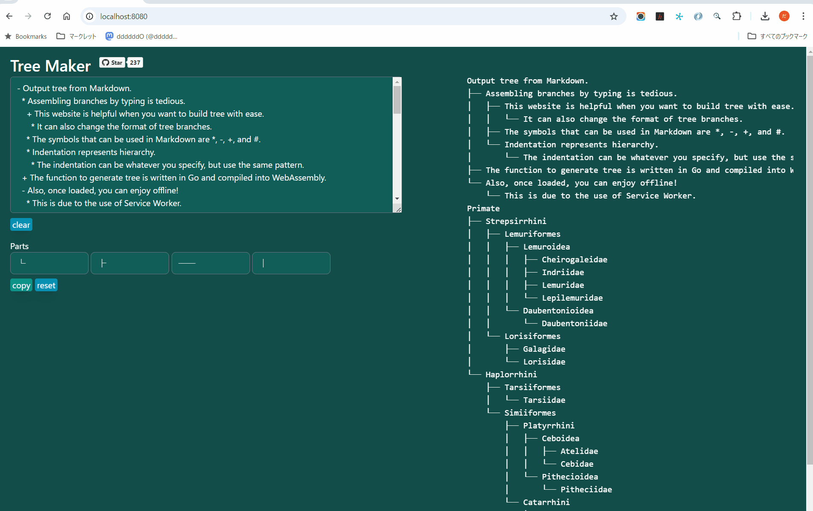
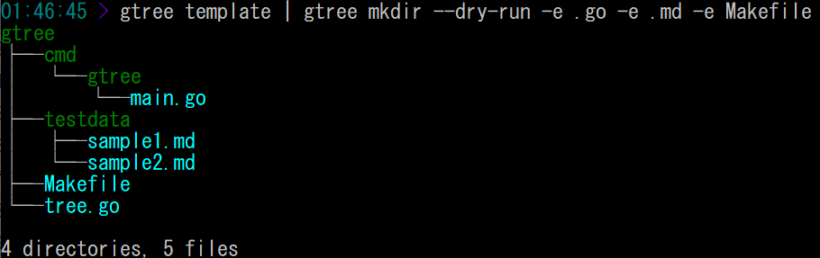

<br>
[](https://ddddddo.github.io/gtree/)<br>
[](https://github.com/ddddddO/gtree/releases) [](https://pkg.go.dev/github.com/ddddddO/gtree)<br>
[](https://github.com/ddddddO/gtree/blob/master/LICENSE) [](https://github.com/avelino/awesome-go#uncategorized)<br>
[](https://codecov.io/gh/ddddddO/gtree) [](https://goreportcard.com/report/github.com/ddddddO/gtree) [](https://github.com/ddddddO/gtree/actions/workflows/ci.yaml)


<br>

Using either Markdown or Programmatically to generate directory trees🌳 and directories🗂, and to verify directories🔍.
Provide CLI, Golang library and Web.

- **[Web](https://github.com/ddddddO/gtree#web)**
- **[CLI](https://github.com/ddddddO/gtree#cli)**
- **[Library - used in Web and CLI](https://github.com/ddddddO/gtree#library---used-in-web-and-cli)**
- **[Library - programmable tree structure](https://github.com/ddddddO/gtree#library---programmable-tree-structure)**
	- You can set up sample project with the `gonew` command. See [`it`](https://github.com/ddddddO/gtree/blob/master/example/README.md).


# Acknowledgments
Thanks for providing very useful CLI for cloud storage tree output🤩🎉</br>
Everyone is encouraged to use them!

## ⭐[_orangekame3/stree_](https://github.com/orangekame3/stree)
CLI for **Amazon S3** tree output.</br>
[_aws s3_](https://awscli.amazonaws.com/v2/documentation/api/latest/reference/s3/index.html) command does not do what `tree` command does, but [**_stree_**](https://github.com/orangekame3/stree) command can display tree!

## ⭐[_owlinux1000/gcstree_](https://github.com/owlinux1000/gcstree)
CLI for **Google Cloud Storage** tree output.</br>
[_gcloud storage_](https://cloud.google.com/sdk/gcloud/reference/storage) command does not do what `tree` command does, but [**_gcstree_**](https://github.com/owlinux1000/gcstree) command can display tree!

# Web

https://ddddddo.github.io/gtree/

This page is that converts from Markdown to tree!<br>
This page calls a function that outputs tree. This function is a Go package compiled as WebAssembly.<br>
The symbols that can be used in Markdown are `*`, `-`, `+`, and `#`.<br>
Indentation represents hierarchy. The indentation can be whatever you specify, but use the same pattern.<br>
You can change the branches like in the image below.<br>
Also, once loaded, you can enjoy offline!<br>



You can open it in your browser with
```console
$ gtree web
```

[source code](cmd/gtree-wasm/)


# CLI

> **Note**<br>
> WASM binary with WASI support are also available.
> Basically, the usage is the same as the CLI built with Go.
> Please refer [here](https://github.com/ddddddO/gtree/blob/master/README_wasi_wasm.md) for usage.

## Installation

<pre>
<b>Go (requires 1.18 or later)</b>
$ go install github.com/ddddddO/gtree/cmd/gtree@latest

<b>Homebrew</b>
$ brew install ddddddO/tap/gtree

<b>Scoop</b>
$ scoop bucket add ddddddO https://github.com/ddddddO/scoop-bucket.git
$ scoop install ddddddO/gtree

<b>deb</b>
$ export GTREE_VERSION=X.X.X
$ curl -o gtree.deb -L https://github.com/ddddddO/gtree/releases/download/v$GTREE_VERSION/gtree_$GTREE_VERSION-1_amd64.deb
$ dpkg -i gtree.deb

<b>rpm</b>
$ export GTREE_VERSION=X.X.X
$ yum install https://github.com/ddddddO/gtree/releases/download/v$GTREE_VERSION/gtree_$GTREE_VERSION-1_amd64.rpm

<b>apk</b>
$ export GTREE_VERSION=X.X.X
$ curl -o gtree.apk -L https://github.com/ddddddO/gtree/releases/download/v$GTREE_VERSION/gtree_$GTREE_VERSION-1_amd64.apk
$ apk add --allow-untrusted gtree.apk

<s><a href="https://aur.archlinux.org/packages/gtree"><b>AUR</b></a></s>
$ wip...

<a href="https://github.com/NixOS/nixpkgs/blob/master/pkgs/tools/text/gtree/default.nix"><b>Nix</b></a>
$ nix-env -i gtree
or
$ nix-shell -p gtree

<a href="https://github.com/macports/macports-ports/blob/master/sysutils/gtree/Portfile"><b>MacPorts</b></a>
$ port install gtree

<a href="https://github.com/aquaproj/aqua-registry/blob/main/pkgs/ddddddO/gtree/pkg.yaml"><b>aqua</b></a>
$ aqua g -i ddddddO/gtree

<a href="https://github.com/ddddddO/gtree/releases"><b>WASI</b></a>
$ Go to GitHub releases and Download `gtree.wasm`

<a href="https://github.com/ddddddO/gtree/pkgs/container/gtree"><b>Docker</b></a>
$ docker pull ghcr.io/ddddddo/gtree:latest
$ docker run ghcr.io/ddddddo/gtree:latest template | docker run -i ghcr.io/ddddddo/gtree:latest output
gtree
├── cmd
│   └── gtree
│       └── main.go
├── testdata
│   ├── sample1.md
│   └── sample2.md
├── Makefile
└── tree.go
</pre>

### etc

**download binary from [here](https://github.com/ddddddO/gtree/releases).**

## Usage

```console
$ gtree --help
NAME:
   gtree - This CLI uses Markdown to generate directory trees and directories itself, and also verifies directories.
           The symbols that can be used in Markdown are '-', '+', '*', and '#'.
           Within Markdown, indentation represents hierarchy. The indentation can be whatever you specify, but use the same pattern.

USAGE:
   gtree [global options] command [command options] [arguments...]

VERSION:
   1.10.2 / revision 85520a1

COMMANDS:
   output, o, out     Outputs tree from markdown.
                      Let's try 'gtree template | gtree output'.
   mkdir, m           Makes directories and files from markdown. It is possible to dry run.
                      Let's try 'gtree template | gtree mkdir -e .go -e .md -e Makefile'.
   verify, vf         Verifies tree structure represented in markdown by comparing it with existing directories.
                      Let's try 'gtree template | gtree verify'.
   template, t, tmpl  Outputs markdown template. Use it to try out gtree CLI.
   web, w, www        Opens "Tree Maker" in your browser and shows the URL in terminal.
   version, v         Prints the version.
   help, h            Shows a list of commands or help for one command

GLOBAL OPTIONS:
   --help, -h     show help
   --version, -v  print the version
```

### *Output* subcommand
```console
$ gtree output --help
NAME:
   gtree output - Outputs tree from markdown.
                  Let's try 'gtree template | gtree output'.

USAGE:
   gtree output [command options] [arguments...]

OPTIONS:
   --file value, -f value               specify the path to markdown file. (default: stdin)
   --massive, -m                        set this option when there are very many blocks of markdown. (default: false)
   --massive-timeout value, --mt value  set this option if you want to set a timeout. (default: 0s)
   --format value                       set this option when specifying output format. "json", "yaml", "toml"
   --watch, -w                          follow changes in markdown file. (default: false)
   --help, -h                           show help
```

#### Try it!

```console
$ gtree template
- gtree
        - cmd
                - gtree
                        - main.go
        - testdata
                - sample1.md
                - sample2.md
        - Makefile
        - tree.go
$ gtree template | gtree output
gtree
├── cmd
│   └── gtree
│       └── main.go
├── testdata
│   ├── sample1.md
│   └── sample2.md
├── Makefile
└── tree.go
```

Other pattern.

```
├── gtree output -f testdata/sample1.md
├── cat testdata/sample1.md | gtree output -f -
└── cat testdata/sample1.md | gtree output
```


#### Usage other than representing a directory.

```console
$ cat testdata/sample2.md | gtree output
k8s_resources
├── (Tier3)
│   └── (Tier2)
│       └── (Tier1)
│           └── (Tier0)
├── Deployment
│   └── ReplicaSet
│       └── Pod
│           └── container(s)
├── CronJob
│   └── Job
│       └── Pod
│           └── container(s)
└── (empty)
    ├── DaemonSet
    │   └── Pod
    │       └── container(s)
    └── StatefulSet
        └── Pod
            └── container(s)
```


#### Multiple roots

```console
$ cat testdata/sample6.md | gtree output
Artiodactyla
├── Artiofabula
│   ├── Cetruminantia
│   │   ├── Whippomorpha
│   │   │   ├── Hippopotamidae
│   │   │   └── Cetacea
│   │   └── Ruminantia
│   └── Suina
└── Tylopoda
Carnivora
├── Feliformia
└── Caniformia
    ├── Canidae
    └── Arctoidea
        ├── Ursidae
        └── x
            ├── Pinnipedia
            └── Musteloidea
                ├── Ailuridae
                └── x
                    ├── Mephitidae
                    └── x
                        ├── Procyonidae
                        └── Mustelidae
```

#### Output JSON

```console
$ cat testdata/sample5.md | gtree output --format json | jq
{
  "value": "a",
  "children": [
    {
      "value": "i",
      "children": [
        {
          "value": "u",
          "children": [
            {
              "value": "k",
              "children": null
            },
            {
              "value": "kk",
              "children": null
            }
          ]
        },
        {
          "value": "t",
          "children": null
        }
      ]
    },
    {
      "value": "e",
      "children": [
        {
          "value": "o",
          "children": null
        }
      ]
    },
    {
      "value": "g",
      "children": null
    }
  ]
}
```

#### Output YAML

```console
$ cat testdata/sample5.md | gtree output --format yaml
value: a
children:
- value: i
  children:
  - value: u
    children:
    - value: k
      children: []
    - value: kk
      children: []
  - value: t
    children: []
- value: e
  children:
  - value: o
    children: []
- value: g
  children: []
```

#### Output TOML

```console
$ cat testdata/sample5.md | gtree output --format toml
value = 'a'
[[children]]
value = 'i'
[[children.children]]
value = 'u'
[[children.children.children]]
value = 'k'
children = []
[[children.children.children]]
value = 'kk'
children = []

[[children.children]]
value = 't'
children = []

[[children]]
value = 'e'
[[children.children]]
value = 'o'
children = []

[[children]]
value = 'g'
children = []

```


### *Mkdir* subcommand

```console
$ gtree mkdir --help
NAME:
   gtree mkdir - Makes directories and files from markdown. It is possible to dry run.
                 Let's try 'gtree template | gtree mkdir -e .go -e .md -e Makefile'.

USAGE:
   gtree mkdir [command options] [arguments...]

OPTIONS:
   --file value, -f value                                       specify the path to markdown file. (default: stdin)
   --dry-run, -d                                                dry run. detects node that is invalid for directory generation. the order of the output and made directories does not always match. (default: false)
   --extension value, -e value [ --extension value, -e value ]  set this option if you want to create file instead of directory. for example, if you want to generate files with ".go" extension: "-e .go"
   --target-dir value                                           set this option if you want to specify the directory you want to make directory. (default: current directory)
   --help, -h                                                   show help
```

#### Try it!

```console
$ gtree template
- gtree
        - cmd
                - gtree
                        - main.go
        - testdata
                - sample1.md
                - sample2.md
        - Makefile
        - tree.go
$ gtree template | gtree mkdir
$ tree gtree/
gtree/
├── cmd
│   └── gtree
│       └── main.go
├── Makefile
├── testdata
│   ├── sample1.md
│   └── sample2.md
└── tree.go

8 directories, 0 files
```

#### *make directories and files*
```console
$ gtree template
- gtree
        - cmd
                - gtree
                        - main.go
        - testdata
                - sample1.md
                - sample2.md
        - Makefile
        - tree.go
$ gtree template | gtree mkdir -e .go -e .md -e Makefile
$ tree gtree/
gtree/
├── cmd
│   └── gtree
│       └── main.go
├── Makefile
├── testdata
│   ├── sample1.md
│   └── sample2.md
└── tree.go

3 directories, 5 files
```

#### *dry run*
Does not create a file and directory.

```console
$ gtree template | gtree mkdir --dry-run -e .go -e .md -e Makefile
gtree
├── cmd
│   └── gtree
│       └── main.go
├── testdata
│   ├── sample1.md
│   └── sample2.md
├── Makefile
└── tree.go

4 directories, 5 files
```




Any invalid file or directory name will result in an error.

```console
$ gtree mkdir --dry-run <<EOS
- root
  - aa
  - bb
    - b/b
EOS
invalid node name: b/b
```

```console
$ gtree mkdir --dry-run <<EOS
- /root
  - aa
  - bb
    - bb
EOS
invalid node name: /root
```

### *Verify* subcommand
```console
$ gtree verify --help
NAME:
   gtree verify - Verifies tree structure represented in markdown by comparing it with existing directories.
                  Let's try 'gtree template | gtree verify'.

USAGE:
   gtree verify [command options] [arguments...]

OPTIONS:
   --file value, -f value  specify the path to markdown file. (default: stdin)
   --target-dir value      set this option if you want to specify the directory you want to verify. (default: current directory)
   --strict                set this option if you want strict directory match validation. (default: non strict)
   --help, -h              show help
```

#### Try it!

```console
$ tree example
example
├── README.md
├── find_pipe_programmable-gtree
│   ├── README.md
│   ├── go.mod
│   ├── go.sum
│   └── main.go
├── go-list_pipe_programmable-gtree
│   ├── README.md
│   ├── go.mod
│   ├── go.sum
│   └── main.go
├── like_cli
│   ├── adapter
│   │   ├── executor.go
│   │   └── indentation.go
│   └── main.go
├── noexist
│   └── xxx
└── programmable
    └── main.go

6 directories, 14 files
$ cat testdata/sample9.md
- example
        - README.md
        - find_pipe_programmable-gtree
                - README.md
                - go.mod
                - go.sum
                - main.go
        - go-list_pipe_programmable-gtree
                - README.md
                - go.mod
                - go.sum
                - main.go
        - like_cli
                - adapter
                        - executor.go
                        - indentation.go
                - main.go
                - kkk
        - programmable
                - main.go
$ cat testdata/sample9.md | gtree verify --strict
Extra paths exist:
        example/noexist
        example/noexist/xxx
Required paths does not exist:
        example/like_cli/kkk
```

inspired by [mactat/framed](https://github.com/mactat/framed) !

# Library - used in Web and CLI

## Installation

Go version requires 1.18 or later.

```console
$ go get github.com/ddddddO/gtree
```

## Usage

The symbols that can be used in Markdown are `*`, `-`, `+`, and `#`.

|Function|Description|Available optional functions|
|--|--|--|
|*Output*|can output trees|WithBranchFormatIntermedialNode/WithBranchFormatLastNode/WithEncodeJSON/WithEncodeTOML/WithEncodeYAML/WithMassive|
|*Mkdir*|can create directories|WithTargetDir/WithFileExtensions/WithDryRun/WithMassive|
|*Verify*|can output the difference between markdown and directories|WithTargetDir/WithStrictVerify/WithMassive|
|*Walk*|can execute user-defined function while traversing tree structure recursively|WithBranchFormatIntermedialNode/WithBranchFormatLastNode/WithMassive|


### *Output* func

```go
package main

import (
	"bytes"
	"fmt"
	"os"
	"strings"

	"github.com/ddddddO/gtree"
)

func main() {
	r1 := bytes.NewBufferString(strings.TrimSpace(`
- root
	- dddd
		- kkkkkkk
			- lllll
				- ffff
				- LLL
					- WWWWW
						- ZZZZZ
				- ppppp
					- KKK
						- 1111111
							- AAAAAAA
	- eee`))
	if err := gtree.Output(os.Stdout, r1); err != nil {
		fmt.Fprintln(os.Stderr, err)
		os.Exit(1)
	}
	// Output:
	// root
	// ├── dddd
	// │   └── kkkkkkk
	// │       └── lllll
	// │           ├── ffff
	// │           ├── LLL
	// │           │   └── WWWWW
	// │           │       └── ZZZZZ
	// │           └── ppppp
	// │               └── KKK
	// │                   └── 1111111
	// │                       └── AAAAAAA
	// └── eee

	r2 := bytes.NewBufferString(strings.TrimSpace(`
- a
  - i
    - u
      - k
      - kk
    - t
  - e
    - o
  - g`))

	// You can customize branch format.
	if err := gtree.Output(os.Stdout, r2,
		gtree.WithBranchFormatIntermedialNode("+->", ":   "),
		gtree.WithBranchFormatLastNode("+->", "    "),
	); err != nil {
		fmt.Fprintln(os.Stderr, err)
		os.Exit(1)
	}
	// Output:
	// a
	// +-> i
	// :   +-> u
	// :   :   +-> k
	// :   :   +-> kk
	// :   +-> t
	// +-> e
	// :   +-> o
	// +-> g
}

```

#### You can also output JSON/YAML/TOML.
- `gtree.WithEncodeJSON()`
- `gtree.WithEncodeTOML()`
- `gtree.WithEncodeYAML()`


### *Mkdir* func

#### `gtree.Mkdir` func makes directories.

You can use `gtree.WithFileExtensions` func to make specified extensions as file.


### *Verify* func

#### `gtree.Verify` func verifies directories.

You can use `gtree.WithTargetDir` func / `gtree.WithStrictVerify` func.

### *Walk* func

<details>
<summary>See sample program</summary>

```go
package main

import (
	"fmt"
	"os"
	"strings"

	"github.com/ddddddO/gtree"
)

func main() {
	src := strings.TrimSpace(`
- a
  - i
    - u
      - k
  - kk
    - t
- e
  - o
    - g`)

	callback := func(wn *gtree.WalkerNode) error {
		fmt.Println(wn.Row())
		return nil
	}

	if err := gtree.Walk(strings.NewReader(src), callback); err != nil {
		fmt.Fprintln(os.Stderr, err)
		os.Exit(1)
	}
	// Output:
	// a
	// ├── i
	// │   └── u
	// │       └── k
	// └── kk
	//     └── t
	// e
	// └── o
	//     └── g

	callback2 := func(wn *gtree.WalkerNode) error {
		fmt.Println("WalkerNode's methods called...")
		fmt.Printf("\tName     : %s\n", wn.Name())
		fmt.Printf("\tBranch   : %s\n", wn.Branch())
		fmt.Printf("\tRow      : %s\n", wn.Row())
		fmt.Printf("\tLevel    : %d\n", wn.Level())
		fmt.Printf("\tPath     : %s\n", wn.Path())
		fmt.Printf("\tHasChild : %t\n", wn.HasChild())
		return nil
	}

	if err := gtree.Walk(strings.NewReader(src), callback2); err != nil {
		fmt.Fprintln(os.Stderr, err)
		os.Exit(1)
	}
	// Output:
	// WalkerNode's methods called...
	// 	Name     : a
	// 	Branch   : 
	// 	Row      : a
	// 	Level    : 1
	// 	Path     : a
	// 	HasChild : true
	// WalkerNode's methods called...
	// 	Name     : i
	// 	Branch   : ├──
	// 	Row      : ├── i
	// 	Level    : 2
	// 	Path     : a/i
	// 	HasChild : true
	// WalkerNode's methods called...
	// 	Name     : u
	// 	Branch   : │   └──
	// 	Row      : │   └── u
	// 	Level    : 3
	// 	Path     : a/i/u
	// 	HasChild : true
	// WalkerNode's methods called...
	// 	Name     : k
	// 	Branch   : │       └──
	// 	Row      : │       └── k
	// 	Level    : 4
	// 	Path     : a/i/u/k
	// 	HasChild : false
	// WalkerNode's methods called...
	// 	Name     : kk
	// 	Branch   : └──
	// 	Row      : └── kk
	// 	Level    : 2
	// 	Path     : a/kk
	// 	HasChild : true
	// WalkerNode's methods called...
	// 	Name     : t
	// 	Branch   :     └──
	// 	Row      :     └── t
	// 	Level    : 3
	// 	Path     : a/kk/t
	// 	HasChild : false
	// WalkerNode's methods called...
	// 	Name     : e
	// 	Branch   : 
	// 	Row      : e
	// 	Level    : 1
	// 	Path     : e
	// 	HasChild : true
	// WalkerNode's methods called...
	// 	Name     : o
	// 	Branch   : └──
	// 	Row      : └── o
	// 	Level    : 2
	// 	Path     : e/o
	// 	HasChild : true
	// WalkerNode's methods called...
	// 	Name     : g
	// 	Branch   :     └──
	// 	Row      :     └── g
	// 	Level    : 3
	// 	Path     : e/o/g
	// 	HasChild : false
}
```

</details>

inspired by [xlab/treeprint](https://github.com/xlab/treeprint#iterating-over-the-tree-nodes) !


# Library - programmable tree structure

> **Note**<br>
> The `gonew` command can be used to set up sample project using gtree library.<br>
> See [here](https://github.com/ddddddO/gtree/blob/master/example/README.md) for details.

## Installation

Go version requires 1.18 or later.

```console
$ go get github.com/ddddddO/gtree
```

## Usage

|Function|Description|Available optional functions|
|--|--|--|
|*OutputProgrammably*|can output tree|WithBranchFormatIntermedialNode/WithBranchFormatLastNode/WithEncodeJSON/WithEncodeTOML/WithEncodeYAML|
|*MkdirProgrammably*|can create directories|WithTargetDir/WithFileExtensions/WithDryRun|
|*VerifyProgrammably*|can output the difference between tree you composed and directories|WithTargetDir/WithStrictVerify|
|*WalkProgrammably*|can execute user-defined function while traversing tree structure recursively|WithBranchFormatIntermedialNode/WithBranchFormatLastNode|

### *OutputProgrammably* func

```go
package main

import (
	"fmt"
	"os"

	"github.com/ddddddO/gtree"
)

func main() {
	var root *gtree.Node = gtree.NewRoot("root")
	root.Add("child 1").Add("child 2").Add("child 3")
	var child4 *gtree.Node = root.Add("child 1").Add("child 2").Add("child 4")
	child4.Add("child 5")
	child4.Add("child 6").Add("child 7")
	root.Add("child 8")
	// you can customize branch format.
	if err := gtree.OutputProgrammably(os.Stdout, root,
		gtree.WithBranchFormatIntermedialNode("+--", ":   "),
		gtree.WithBranchFormatLastNode("+--", "    "),
	); err != nil {
		fmt.Fprintln(os.Stderr, err)
		os.Exit(1)
	}
	// Output:
	// root
	// +-- child 1
	// :   +-- child 2
	// :       +-- child 3
	// :       +-- child 4
	// :           +-- child 5
	// :           +-- child 6
	// :               +-- child 7
	// +-- child 8

	primate := preparePrimate()
	// default branch format.
	if err := gtree.OutputProgrammably(os.Stdout, primate); err != nil {
		fmt.Fprintln(os.Stderr, err)
		os.Exit(1)
	}
	// Output:
	// Primate
	// ├── Strepsirrhini
	// │   ├── Lemuriformes
	// │   │   ├── Lemuroidea
	// │   │   │   ├── Cheirogaleidae
	// │   │   │   ├── Indriidae
	// │   │   │   ├── Lemuridae
	// │   │   │   └── Lepilemuridae
	// │   │   └── Daubentonioidea
	// │   │       └── Daubentoniidae
	// │   └── Lorisiformes
	// │       ├── Galagidae
	// │       └── Lorisidae
	// └── Haplorrhini
	//     ├── Tarsiiformes
	//     │   └── Tarsiidae
	//     └── Simiiformes
	//         ├── Platyrrhini
	//         │   ├── Ceboidea
	//         │   │   ├── Atelidae
	//         │   │   └── Cebidae
	//         │   └── Pithecioidea
	//         │       └── Pitheciidae
	//         └── Catarrhini
	//             ├── Cercopithecoidea
	//             │   └── Cercopithecidae
	//             └── Hominoidea
	//                 ├── Hylobatidae
	//                 └── Hominidae
}

func preparePrimate() *gtree.Node {
	primate := gtree.NewRoot("Primate")
	strepsirrhini := primate.Add("Strepsirrhini")
	haplorrhini := primate.Add("Haplorrhini")
	lemuriformes := strepsirrhini.Add("Lemuriformes")
	lorisiformes := strepsirrhini.Add("Lorisiformes")

	lemuroidea := lemuriformes.Add("Lemuroidea")
	lemuroidea.Add("Cheirogaleidae")
	lemuroidea.Add("Indriidae")
	lemuroidea.Add("Lemuridae")
	lemuroidea.Add("Lepilemuridae")

	lemuriformes.Add("Daubentonioidea").Add("Daubentoniidae")

	lorisiformes.Add("Galagidae")
	lorisiformes.Add("Lorisidae")

	haplorrhini.Add("Tarsiiformes").Add("Tarsiidae")
	simiiformes := haplorrhini.Add("Simiiformes")

	platyrrhini := haplorrhini.Add("Platyrrhini")
	ceboidea := platyrrhini.Add("Ceboidea")
	ceboidea.Add("Atelidae")
	ceboidea.Add("Cebidae")
	platyrrhini.Add("Pithecioidea").Add("Pitheciidae")

	catarrhini := simiiformes.Add("Catarrhini")
	catarrhini.Add("Cercopithecoidea").Add("Cercopithecidae")
	hominoidea := catarrhini.Add("Hominoidea")
	hominoidea.Add("Hylobatidae")
	hominoidea.Add("Hominidae")

	return primate
}

```

#### The program below converts the result of `find` into a tree.

```go
package main

import (
	"bufio"
	"fmt"
	"os"
	"strings"

	"github.com/ddddddO/gtree"
)

// Example:
// $ cd github.com/ddddddO/gtree
// $ find . -type d -name .git -prune -o -type f -print
// ./config.go
// ./node_generator_test.go
// ./example/like_cli/adapter/indentation.go
// ./example/like_cli/adapter/executor.go
// ./example/like_cli/main.go
// ./example/find_pipe_programmable-gtree/main.go
// ...
// $ find . -type d -name .git -prune -o -type f -print | go run example/find_pipe_programmable-gtree/main.go
// << See "Output:" below. >>
func main() {
	var (
		root *gtree.Node
		node *gtree.Node
	)
	scanner := bufio.NewScanner(os.Stdin)
	for scanner.Scan() {
		line := scanner.Text()              // e.g.) "./example/find_pipe_programmable-gtree/main.go"
		splited := strings.Split(line, "/") // e.g.) [. example find_pipe_programmable-gtree main.go]

		for i, s := range splited {
			if root == nil {
				root = gtree.NewRoot(s) // s := "."
				node = root
				continue
			}
			if i == 0 {
				continue
			}

			tmp := node.Add(s)
			node = tmp
		}
		node = root
	}

	if err := gtree.OutputProgrammably(os.Stdout, root); err != nil {
		fmt.Fprintln(os.Stderr, err)
		os.Exit(1)
	}
	// Output:
	// .
	// ├── config.go
	// ├── node_generator_test.go
	// ├── example
	// │   ├── like_cli
	// │   │   ├── adapter
	// │   │   │   ├── indentation.go
	// │   │   │   └── executor.go
	// │   │   └── main.go
	// │   ├── find_pipe_programmable-gtree
	// │   │   └── main.go
	// │   ├── go-list_pipe_programmable-gtree
	// │   │   └── main.go
	// │   └── programmable
	// │       └── main.go
	// ├── file_considerer.go
	// ├── node.go
	// ├── node_generator.go
	// ├── .gitignore
	// ...
}
```

### *MkdirProgrammably* func

```go
package main

import (
	"fmt"

	"github.com/ddddddO/gtree"
)

func main() {
	primate := preparePrimate()
	if err := gtree.MkdirProgrammably(primate); err != nil {
		fmt.Fprintln(os.Stderr, err)
		os.Exit(1)
	}
	// Output(using Linux 'tree' command):
	// 22:20:43 > tree Primate/
	// Primate/
	// ├── Haplorrhini
	// │   ├── Simiiformes
	// │   │   ├── Catarrhini
	// │   │   │   ├── Cercopithecoidea
	// │   │   │   │   └── Cercopithecidae
	// │   │   │   └── Hominoidea
	// │   │   │       ├── Hominidae
	// │   │   │       └── Hylobatidae
	// │   │   └── Platyrrhini
	// │   │       ├── Ceboidea
	// │   │       │   ├── Atelidae
	// │   │       │   └── Cebidae
	// │   │       └── Pithecioidea
	// │   │           └── Pitheciidae
	// │   └── Tarsiiformes
	// │       └── Tarsiidae
	// └── Strepsirrhini
	// 	├── Lemuriformes
	// 	│   ├── Daubentonioidea
	// 	│   │   └── Daubentoniidae
	// 	│   └── Lemuroidea
	// 	│       ├── Cheirogaleidae
	// 	│       ├── Indriidae
	// 	│       ├── Lemuridae
	// 	│       └── Lepilemuridae
	// 	└── Lorisiformes
	// 		├── Galagidae
	// 		└── Lorisidae
	//
	// 28 directories, 0 files
}
```

[details](https://github.com/ddddddO/gtree/blob/master/example/programmable/main.go#L354)


#### Make directories and files with specific extensions.

```go
package main

import (
	"fmt"

	"github.com/ddddddO/gtree"
)

func main() {
	gtreeDir := gtree.NewRoot("gtree")
	gtreeDir.Add("cmd").Add("gtree").Add("main.go")
	gtreeDir.Add("Makefile")
	testdataDir := gtreeDir.Add("testdata")
	testdataDir.Add("sample1.md")
	testdataDir.Add("sample2.md")
	gtreeDir.Add("tree.go")

	// make directories and files with specific extensions.
	if err := gtree.MkdirProgrammably(
		gtreeDir,
		gtree.WithFileExtensions([]string{".go", ".md", "Makefile"}),
	); err != nil {
		fmt.Fprintln(os.Stderr, err)
		os.Exit(1)
	}
	// Output(using Linux 'tree' command):
	// 09:44:50 > tree gtree/
	// gtree/
	// ├── cmd
	// │   └── gtree
	// │       └── main.go
	// ├── Makefile
	// ├── testdata
	// │   ├── sample1.md
	// │   └── sample2.md
	// └── tree.go
	//
	// 3 directories, 5 files
}
```

### *VerifyProgrammably* func

You can use `gtree.WithTargetDir` func / `gtree.WithStrictVerify` func.

### *WalkProgrammably* func

```go
package main

import (
	"fmt"
	"os"

	"github.com/ddddddO/gtree"
)

func main() {
	root := gtree.NewRoot("root")
	root.Add("child 1").Add("child 2").Add("child 3")
	root.Add("child 5")
	root.Add("child 1").Add("child 2").Add("child 4")

	callback := func(wn *gtree.WalkerNode) error {
		fmt.Println(wn.Row())
		return nil
	}

	if err := gtree.WalkProgrammably(root, callback); err != nil {
		fmt.Fprintln(os.Stderr, err)
		os.Exit(1)
	}
	// Output:
	// root
	// ├── child 1
	// │   └── child 2
	// │       ├── child 3
	// │       └── child 4
	// └── child 5

	callback2 := func(wn *gtree.WalkerNode) error {
		fmt.Println("WalkerNode's methods called...")
		fmt.Printf("\tName     : %s\n", wn.Name())
		fmt.Printf("\tBranch   : %s\n", wn.Branch())
		fmt.Printf("\tRow      : %s\n", wn.Row())
		fmt.Printf("\tLevel    : %d\n", wn.Level())
		fmt.Printf("\tPath     : %s\n", wn.Path())
		fmt.Printf("\tHasChild : %t\n", wn.HasChild())
		return nil
	}

	if err := gtree.WalkProgrammably(root, callback2); err != nil {
		fmt.Fprintln(os.Stderr, err)
		os.Exit(1)
	}
	// Output:
	// WalkerNode's methods called...
	//         Name     : root
	//         Branch   : 
	//         Row      : root
	//         Level    : 1
	//         Path     : root
	//         HasChild : true
	// WalkerNode's methods called...
	//         Name     : child 1
	//         Branch   : ├──
	//         Row      : ├── child 1
	//         Level    : 2
	//         Path     : root/child 1
	//         HasChild : true
	// WalkerNode's methods called...
	//         Name     : child 2
	//         Branch   : │   └──
	//         Row      : │   └── child 2
	//         Level    : 3
	//         Path     : root/child 1/child 2
	//         HasChild : true
	// WalkerNode's methods called...
	//         Name     : child 3
	//         Branch   : │       ├──
	//         Row      : │       ├── child 3
	//         Level    : 4
	//         Path     : root/child 1/child 2/child 3
	//         HasChild : false
	// WalkerNode's methods called...
	//         Name     : child 4
	//         Branch   : │       └──
	//         Row      : │       └── child 4
	//         Level    : 4
	//         Path     : root/child 1/child 2/child 4
	//         HasChild : false
	// WalkerNode's methods called...
	//         Name     : child 5
	//         Branch   : └──
	//         Row      : └── child 5
	//         Level    : 2
	//         Path     : root/child 5
	//         HasChild : false
}
```

# Process

> **Note**<br>
> This process is for the Massive Roots mode.

## e.g. [*gtree/pipeline_tree.go*](https://github.com/ddddddO/gtree/blob/master/pipeline_tree.go)

<image src="assets/process.svg" width=100%>


# Performance

> **Warning**<br>
> Depends on the environment.

- Comparison simple implementation and pipeline implementation.
- In the case of few Roots, simple implementation is faster in execution!
	- Use this one by default.
- However, for multiple Roots, pipeline implementation execution speed tends to be faster💪✨
	- In the CLI, it is available by specifying `--massive`.
	- In the Go program, it is available by specifying `WithMassive` func.

<image src="assets/performance.svg" width=100%>

<details><summary>Benchmark log</summary>

## Simple implementation
```console
11:19:22 > go test -benchmem -bench Benchmark -benchtime 100x benchmark_simple_test.go
goos: linux
goarch: amd64
cpu: Intel(R) Core(TM) i5-7200U CPU @ 2.50GHz
BenchmarkOutput_singleRoot-4                 100             35375 ns/op           13856 B/op        171 allocs/op
BenchmarkOutput_tenRoots-4                   100            200540 ns/op           72920 B/op       1597 allocs/op
BenchmarkOutput_fiftyRoots-4                 100            730156 ns/op          569851 B/op       7919 allocs/op
BenchmarkOutput_hundredRoots-4               100           1706493 ns/op         1714260 B/op      15820 allocs/op
BenchmarkOutput_fiveHundredsRoots-4          100          16412090 ns/op        32245140 B/op      79022 allocs/op
BenchmarkOutput_thousandRoots-4              100          55142492 ns/op        120929674 B/op    158025 allocs/op
BenchmarkOutput_3000Roots-4                  100         489121246 ns/op        1035617527 B/op   474029 allocs/op
BenchmarkOutput_6000Roots-4                  100        1613641261 ns/op        4087694372 B/op   948033 allocs/op
BenchmarkOutput_10000Roots-4                 100        3913090646 ns/op        11293191221 B/op         1580035 allocs/op
PASS
ok      command-line-arguments  614.944s
```

## Pipeline implementation
```console
11:29:43 > go test -benchmem -bench Benchmark -benchtime 100x benchmark_pipeline_test.go
goos: linux
goarch: amd64
cpu: Intel(R) Core(TM) i5-7200U CPU @ 2.50GHz
BenchmarkOutput_pipeline_singleRoot-4                100            188706 ns/op           24236 B/op        300 allocs/op
BenchmarkOutput_pipeline_tenRoots-4                  100            367758 ns/op          115970 B/op       2186 allocs/op
BenchmarkOutput_pipeline_fiftyRoots-4                100            947879 ns/op          542188 B/op      10592 allocs/op
BenchmarkOutput_pipeline_hundredRoots-4              100           1711537 ns/op         1099636 B/op      21094 allocs/op
BenchmarkOutput_pipeline_fiveHundredsRoots-4         100           6892261 ns/op         5524905 B/op     105107 allocs/op
BenchmarkOutput_pipeline_thousandRoots-4             100          13100335 ns/op        11225942 B/op     210115 allocs/op
BenchmarkOutput_pipeline_3000Roots-4                 100          40694497 ns/op        33399766 B/op     630142 allocs/op
BenchmarkOutput_pipeline_6000Roots-4                 100          85807944 ns/op        66974524 B/op    1260171 allocs/op
BenchmarkOutput_pipeline_10000Roots-4                100         151486713 ns/op        113908462 B/op   2100208 allocs/op
PASS
ok      command-line-arguments  30.670s
```

</details>


# Documents
## Japanese
- [Goでtreeを表現する](https://zenn.dev/ddddddo/articles/8cd85c68763f2e)
- [Markdown形式の入力からtreeを出力するCLI/Web](https://zenn.dev/ddddddo/articles/ad97623a004496)
- [Markdown形式の入力からファイル/ディレクトリを生成するCLI/Goパッケージ](https://zenn.dev/ddddddo/articles/460d12e8c07763)
- [感想](https://scrapbox.io/ddddddo/useful_tools)

## English
- [Want to output a tree in Go?](https://medium.com/@allowing_whip_guineapig_430/want-to-output-a-tree-in-go-1851f9fc9900)
- [Generate directory trees🌳 and the directories itself📁 using Markdown or Programmatically.](https://www.reddit.com/r/commandline/comments/146nk54/generate_directory_trees_and_the_directories/)

# Star History

[](https://star-history.com/#ddddddO/gtree&Date)
