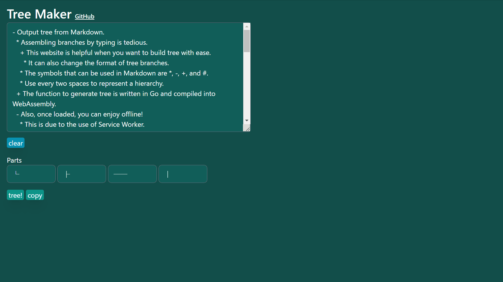
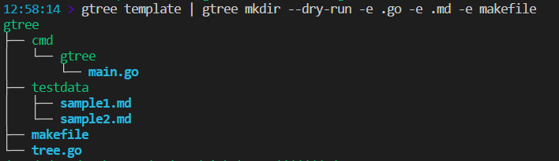

# gtree

[](https://ddddddo.github.io/gtree/)<br>
[](https://github.com/ddddddO/gtree/releases) [](https://pkg.go.dev/github.com/ddddddO/gtree)<br>
[](https://github.com/ddddddO/gtree/blob/master/LICENSE) [](https://github.com/avelino/awesome-go#uncategorized)<br>
[](https://github.com/ddddddO/gtree/actions/workflows/ci.yaml) [](https://codecov.io/gh/ddddddO/gtree) [](https://goreportcard.com/report/github.com/ddddddO/gtree)

Output tree🌳 or Make directories(files)📁 from Markdown or Programmatically. Provide CLI, Go Packages and Web.

```
# Description
├── Output tree from markdown or programmatically.
│   ├── Output format is tree or yaml or toml or json.
│   └── Default tree.
├── Make directories from markdown or programmatically.
│   ├── It is possible to dry run.
│   └── You can use `-e` flag to make specified extensions as file.
├── Output a markdown template that can be used with either `output` subcommand or `mkdir` subcommand.
└── Provide CLI, Go Packages and Web.
```

(outputted by `cat testdata/sample0.md | gtree output --fs`)

## Web

https://ddddddo.github.io/gtree/

This page calls a function that outputs tree. This function is a Go package compiled as WebAssembly.<br>
You can change the branches like in the image below.<br>
Also, once loaded, you can enjoy offline!<br>



## Package(1) / like CLI
[read me!](https://github.com/ddddddO/gtree/blob/master/README_Package_1.md#package1--like-cli)


## Package(2) / generate a tree programmatically
[read me!](https://github.com/ddddddO/gtree/blob/master/README_Package_2.md#package2--generate-a-tree-programmatically)

## CLI
### Installation

Go version requires 1.18 or later.

```console
$ go install github.com/ddddddO/gtree/cmd/gtree@latest
```

or using Homebrew.
```console
$ brew install ddddddO/tap/gtree
```

or [docker image](https://github.com/ddddddO/gtree/pkgs/container/gtree).
```console
$ docker pull ghcr.io/ddddddo/gtree:latest
$ docker run ghcr.io/ddddddo/gtree:latest template | docker run -i ghcr.io/ddddddo/gtree:latest output
gtree
├── cmd
│   └── gtree
│       └── main.go
├── testdata
│   ├── sample1.md
│   └── sample2.md
├── Makefile
└── tree.go
```

**or, download binary from [here](https://github.com/ddddddO/gtree/releases).**

### Usage

```console
$ gtree --help
NAME:
   gtree - This CLI outputs tree or makes directories from markdown.

USAGE:
   gtree [global options] command [command options] [arguments...]

COMMANDS:
   output, o, out     Output tree from markdown. Let's try 'gtree template | gtree output'. Output format is tree or yaml or toml or json. Default tree.
   mkdir, m           Make directories(and files) from markdown. It is possible to dry run. Let's try 'gtree template | gtree mkdir -e .go -e .md -e Makefile'.
   template, t, tmpl  Output markdown template.
   version, v         Output gtree version.
   help, h            Shows a list of commands or help for one command

GLOBAL OPTIONS:
   --help, -h  show help (default: false)
```

#### *Output* subcommand
```console
$ gtree output --help
NAME:
   gtree output - Output tree from markdown. Let's try 'gtree template | gtree output'. Output format is tree or yaml or toml or json. Default tree.

USAGE:
   gtree output [command options] [arguments...]

OPTIONS:
   --file value, -f value  Markdown file path. (default: stdin)
   --two-spaces, --ts      Markdown is Two Spaces indentation. (default: tab spaces)
   --four-spaces, --fs     Markdown is Four Spaces indentation. (default: tab spaces)
   --json, -j              Output JSON format. (default: stdout)
   --yaml, -y              Output YAML format. (default: stdout)
   --toml, -t              Output TOML format. (default: stdout)
   --watch, -w             Watching markdown file. (default: false)
   --help, -h              show help (default: false)
```

```console
$ gtree template
- gtree
        - cmd
                - gtree
                        - main.go
        - testdata
                - sample1.md
                - sample2.md
        - Makefile
        - tree.go
$ gtree template | gtree output
gtree
├── cmd
│   └── gtree
│       └── main.go
├── testdata
│   ├── sample1.md
│   └── sample2.md
├── Makefile
└── tree.go
```

When Markdown is indented as a tab.

```
├── gtree output -f testdata/sample1.md
├── cat testdata/sample1.md | gtree output -f -
└── cat testdata/sample1.md | gtree output
```

For 2 or 4 spaces instead of tabs, `-ts` or `-fs` is required.


<details>
<summary>More details</summary>

- Usage other than representing a directory.

```console
$ cat testdata/sample2.md | gtree output
k8s_resources
├── (Tier3)
│   └── (Tier2)
│       └── (Tier1)
│           └── (Tier0)
├── Deployment
│   └── ReplicaSet
│       └── Pod
│           └── container(s)
├── CronJob
│   └── Job
│       └── Pod
│           └── container(s)
├── (empty)
│   └── DaemonSet
│       └── Pod
│           └── container(s)
└── (empty)
    └── StatefulSet
        └── Pod
            └── container(s)
```

---
- Two spaces indent

```console
$ cat testdata/sample4.md | gtree output -ts
a
├── i
│   ├── u
│   │   ├── k
│   │   └── kk
│   └── t
├── e
│   └── o
└── g
```

- Four spaces indent

```console
$ cat testdata/sample5.md | gtree output -fs
a
├── i
│   ├── u
│   │   ├── k
│   │   └── kk
│   └── t
├── e
│   └── o
└── g
```

- Multiple roots

```console
$ cat testdata/sample6.md | gtree output
a
├── i
│   ├── u
│   │   ├── k
│   │   └── kk
│   └── t
├── e
│   └── o
└── g
a
├── i
│   ├── u
│   │   ├── k
│   │   └── kk
│   └── t
├── e
│   └── o
└── g
```

- Output JSON

```console
$ cat testdata/sample5.md | gtree output -fs -j | jq
{
  "value": "a",
  "children": [
    {
      "value": "i",
      "children": [
        {
          "value": "u",
          "children": [
            {
              "value": "k",
              "children": null
            },
            {
              "value": "kk",
              "children": null
            }
          ]
        },
        {
          "value": "t",
          "children": null
        }
      ]
    },
    {
      "value": "e",
      "children": [
        {
          "value": "o",
          "children": null
        }
      ]
    },
    {
      "value": "g",
      "children": null
    }
  ]
}
```

- Output YAML

```console
$ cat testdata/sample5.md | gtree output -fs -y
value: a
children:
- value: i
  children:
  - value: u
    children:
    - value: k
      children: []
    - value: kk
      children: []
  - value: t
    children: []
- value: e
  children:
  - value: o
    children: []
- value: g
  children: []
```

- Output TOML

```console
$ cat testdata/sample5.md | gtree output -fs -t
value = 'a'
[[children]]
value = 'i'
[[children.children]]
value = 'u'
[[children.children.children]]
value = 'k'
children = []
[[children.children.children]]
value = 'kk'
children = []

[[children.children]]
value = 't'
children = []

[[children]]
value = 'e'
[[children.children]]
value = 'o'
children = []

[[children]]
value = 'g'
children = []

```

</details>

---
#### *Mkdir* subcommand

```console
$ gtree mkdir --help
NAME:
   gtree mkdir - Make directories from markdown. It is possible to dry run. Let's try 'gtree template | gtree mkdir -e .go -e .md -e Makefile'.

USAGE:
   gtree mkdir [command options] [arguments...]

OPTIONS:
   --file value, -f value                    Markdown file path. (default: stdin)
   --two-spaces, --ts                        Markdown is Two Spaces indentation. (default: tab spaces)
   --four-spaces, --fs                       Markdown is Four Spaces indentation. (default: tab spaces)
   --dry-run, -d, --dr                       Dry run. Detects node that is invalid for directory generation. The order of the output and made directories does not always match. (default: false)
   --extension value, -e value, --ext value  Specified extension will be created as file.
   --help, -h                                show help (default: false)
```

```console
$ gtree template
- gtree
        - cmd
                - gtree
                        - main.go
        - testdata
                - sample1.md
                - sample2.md
        - Makefile
        - tree.go
$ gtree template | gtree mkdir
$ tree gtree/
gtree/
├── cmd
│   └── gtree
│       └── main.go
├── Makefile
├── testdata
│   ├── sample1.md
│   └── sample2.md
└── tree.go

8 directories, 0 files
```

##### *make directories and files*
```console
$ gtree template
- gtree
        - cmd
                - gtree
                        - main.go
        - testdata
                - sample1.md
                - sample2.md
        - Makefile
        - tree.go
$ gtree template | gtree mkdir -e .go -e .md -e Makefile
$ tree gtree/
gtree/
├── cmd
│   └── gtree
│       └── main.go
├── Makefile
├── testdata
│   ├── sample1.md
│   └── sample2.md
└── tree.go

3 directories, 5 files
```

##### *dry run*
Does not create a file and directory.

```console
$ gtree template | gtree mkdir --dry-run -e .go -e .md -e Makefile
gtree
├── cmd
│   └── gtree
│       └── main.go
├── testdata
│   ├── sample1.md
│   └── sample2.md
├── Makefile
└── tree.go

4 directories, 5 files
```

↑ colored output<br>



Any invalid file or directory name will result in an error.

```console
$ gtree mkdir --dry-run --ts <<EOS
- root
  - aa
  - bb
    - b/b
EOS
invalid node name: b/b
```

```console
$ gtree mkdir --dry-run --ts <<EOS
- /root
  - aa
  - bb
    - bb
EOS
invalid path: /root/aa
```

---

## Documents
- [Markdown形式の入力からtreeを出力するCLI](https://zenn.dev/ddddddo/articles/ad97623a004496)
- [Goでtreeを表現する](https://zenn.dev/ddddddo/articles/8cd85c68763f2e)
- [Markdown形式の入力からファイル/ディレクトリを生成するCLI/Goパッケージ](https://zenn.dev/ddddddo/articles/460d12e8c07763)
- [感想](https://scrapbox.io/ddddddo/useful_tools)


## Star History
[](https://star-history.com/#ddddddO/gtree&Date)
